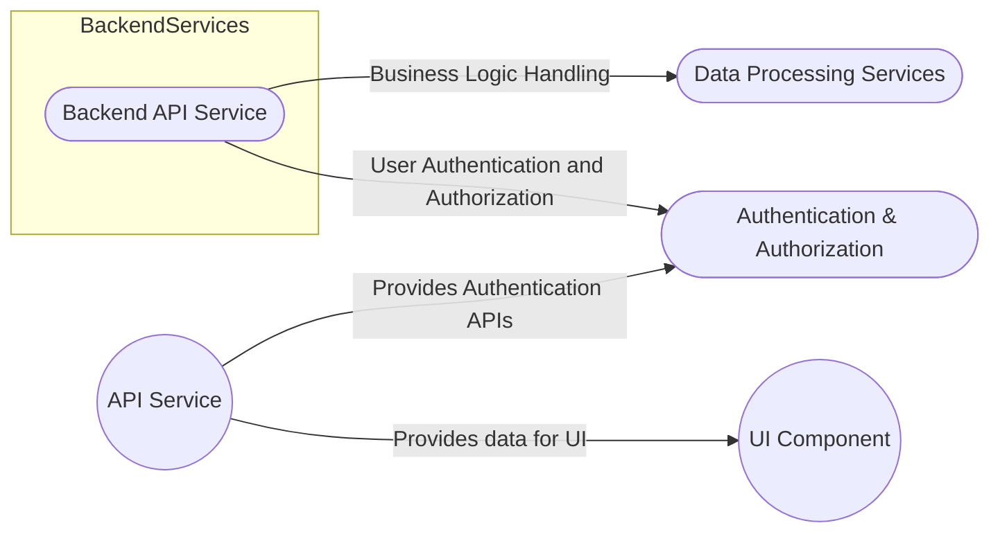

```mermaid
graph LR;
SIAPI((API Service)) -->|Provides data for UI| UIC((UI Component));
subgraph BackendServices
APIService([Backend API Service])
end
APIService -->|User Authentication and Authorization| AAService([Authentication & Authorization]);
APIService -->|Business Logic Handling| BPService([Data Processing Services]);
SIAPI -->|Provides Authentication APIs| AAService;
```