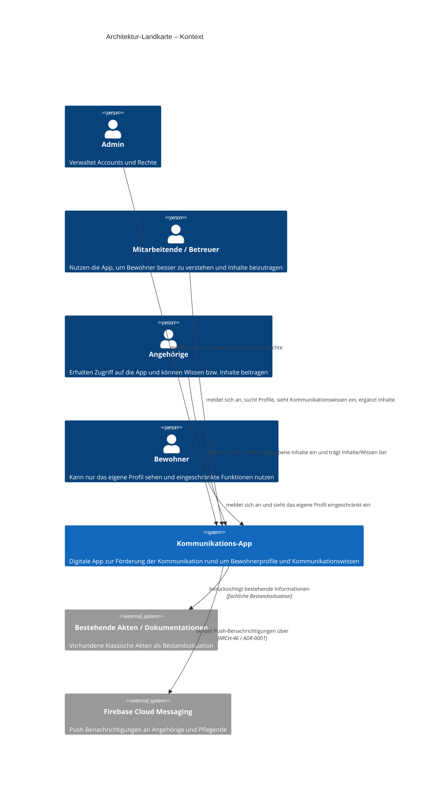
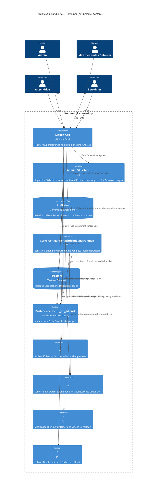

# Level 1 — Kontext

# Level 2 — Container, NUR BELEGT

| Kasten | Beleg |
|---|---|
| Mobile App | ARCH-01, ARCH-03, ARCH-36, ARCH-37 |
| Admin-Bildschirm | ARCH-13 |
| Audit-Log | ARCH-47, ADR 0002-unveraenderlicher-audit-log-rahmen-fuer-einsichtnahmen.md |
| Serverseitiger Benachrichtigungsrahmen | ARCH-48, ADR 0003-serverseitiger-benachrichtigungsrahmen-fuer-besuchserinnerun.md |
| Firestore | ARCH-39 |
| Push-Benachrichtigungsdienst | ARCH-46, ADR 0001-firebase-cloud-messaging-fuer-push-benachrichtigungen.md |
| ? (Authentifizierung / Account-Backend ungeklaert) | ARCH-07, ARCH-08, ARCH-12 |
| ? (Serverseitige Durchsetzung der Einrichtungsgrenze ungeklaert) | ARCH-11 |
| ? (Medienspeicherung für Bilder und Videos ungeklaert) | ARCH-19, ARCH-20, ARCH-22, ARCH-23 |
| ? (Lokaler Gerätespeicher / Cache ungeklaert) | ARCH-40 |

## Offene Architektur-Lücken

- Wie wird die Authentifizierung und Account-Verwaltung technisch umgesetzt, wenn es keine Selbstregistrierung geben darf und Accounts intern vergeben werden müssen?
- Wie wird die Einrichtungsgrenze technisch und serverseitig durchgesetzt, sodass Mitarbeitende nur Profile ihrer eigenen Einrichtung sehen und bearbeiten können?
- Wo und wie werden Bilder und Videos für About Me und Kommunikationsseiten technisch gespeichert und ausgeliefert?
- Ob und wie Cloud-Daten lokal auf dem Gerät gespeichert oder gecacht werden sollen, einschließlich Verhalten bei Offline-Nutzung und Schutz lokal gespeicherter Daten?