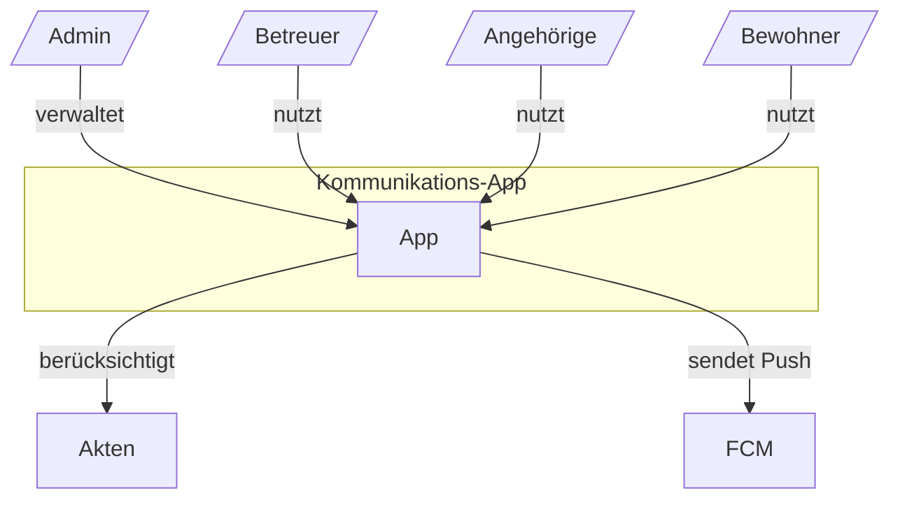
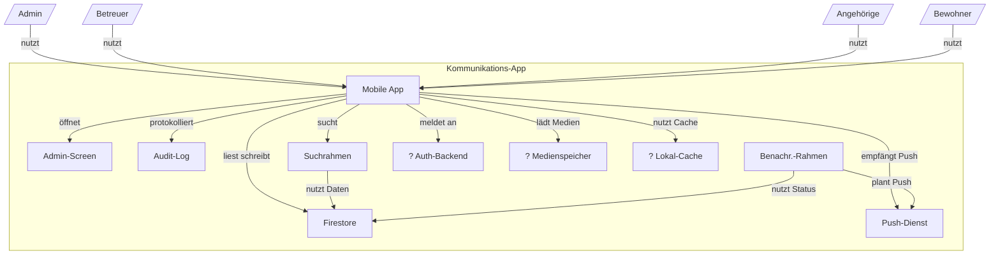

# Architektur-Landkarte (C4)

> Version: 1 · Stand: 2026-08-21 18:45 UTC
> Freigabe: Autor (Steward-Chat) · Entwurf: Steward aus der Projektwahrheit (Core)

# Level 1 — Kontext

# Level 2 — Container, NUR BELEGT

| Kasten | Technologie/Detail | Beleg |
|---|---|---|
| Mobile App | Flutter / Dart; plattformübergreifend für iPhone und Android | ARCH-01, ARCH-03, ARCH-36, ARCH-37 |
| Admin-Screen | Separater Bildschirm für Account- und Rechteverwaltung, nur für Admins erwogen | ARCH-13 |
| Audit-Log | Serverseitig, append-only; Einsicht nur für Admins | ARCH-47, ADR 0002-unveraenderlicher-audit-log-rahmen-fuer-einsichtnahmen.md |
| Benachr.-Rahmen | Serverseitige zentrale Planung und Rücknahme von Besuchserinnerungen | ARCH-48, ADR 0003-serverseitiger-benachrichtigungsrahmen-fuer-besuchserinnerun.md |
| Suchrahmen | Serverseitige Suche mit Einrichtungsgrenze für bewohnerprofilübergreifende Stichwortsuche | ARCH-11, ADR 0004-einrichtungsgebundener-serverseitiger-suchrahmen.md |
| Firestore | Firebase Firestore als vorläufig vorgesehene Datenbanklösung | ARCH-39 |
| Push-Dienst | Firebase Cloud Messaging für Push-Benachrichtigungen | ARCH-46, ADR 0001-firebase-cloud-messaging-fuer-push-benachrichtigungen.md |
| ? Auth-Backend | Authentifizierung / Account-Backend ungeklärt; keine Selbstregistrierung, interne Accounts | ARCH-07, ARCH-08, ARCH-12 |
| ? Medienspeicher | Medienspeicherung für Bilder und Videos ungeklärt | ARCH-19, ARCH-20, ARCH-22, ARCH-23 |
| ? Lokal-Cache | Lokaler Gerätespeicher / Cache ungeklärt | ARCH-40 |

## Offene Architektur-Lücken

- Wie wird die Authentifizierung und Account-Verwaltung technisch umgesetzt, wenn es keine Selbstregistrierung geben darf und Accounts intern vergeben werden müssen?
- Wo und wie werden Bilder und Videos für About Me und Kommunikationsseiten technisch gespeichert und ausgeliefert?
- Ob und wie Cloud-Daten lokal auf dem Gerät gespeichert oder gecacht werden sollen, einschließlich Verhalten bei Offline-Nutzung und Schutz lokal gespeicherter Daten?