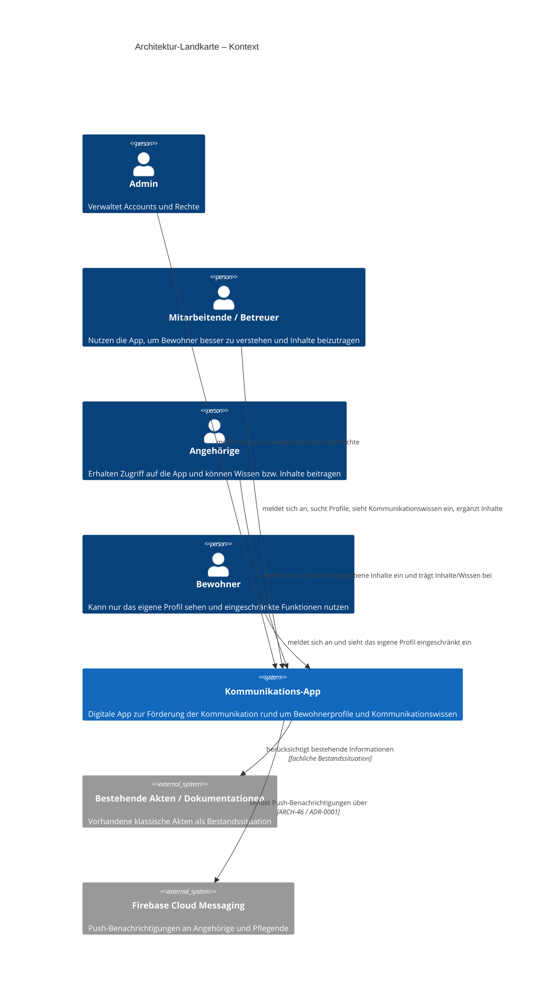
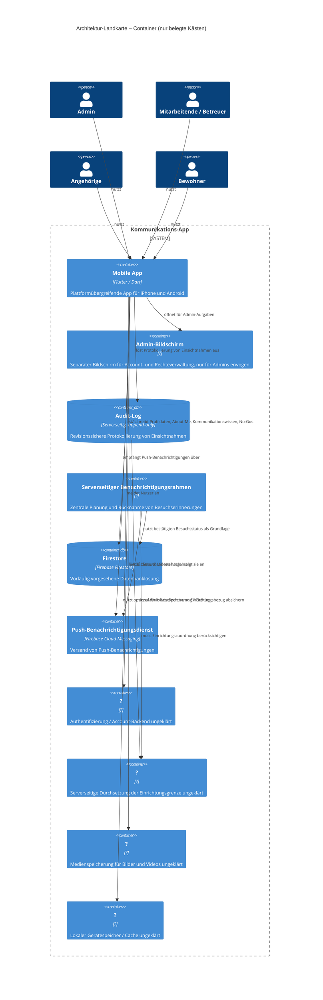

ARTEFAKT: Architektur-Landkarte (C4) (art=c4, Ziel-Datei docs/c4.md)

== AKTUELLER STAND (UPDATE-Fall: Unveraendertes woertlich uebernehmen, nur Belegtes aendern) ==
# Architektur-Landkarte (C4)

> Version: 1 · Stand: 2026-08-21 18:45 UTC
> Freigabe: Autor (Steward-Chat) · Entwurf: Steward aus der Projektwahrheit (Core)

# Level 1 — Kontext

# Level 2 — Container, NUR BELEGT

| Kasten | Beleg |
|---|---|
| Mobile App | ARCH-01, ARCH-03, ARCH-36, ARCH-37 |
| Admin-Bildschirm | ARCH-13 |
| Audit-Log | ARCH-47, ADR 0002-unveraenderlicher-audit-log-rahmen-fuer-einsichtnahmen.md |
| Serverseitiger Benachrichtigungsrahmen | ARCH-48, ADR 0003-serverseitiger-benachrichtigungsrahmen-fuer-besuchserinnerun.md |
| Firestore | ARCH-39 |
| Push-Benachrichtigungsdienst | ARCH-46, ADR 0001-firebase-cloud-messaging-fuer-push-benachrichtigungen.md |
| ? (Authentifizierung / Account-Backend ungeklärt) | ARCH-07, ARCH-08, ARCH-12 |
| ? (Serverseitige Durchsetzung der Einrichtungsgrenze ungeklärt) | ARCH-11 |
| ? (Medienspeicherung für Bilder und Videos ungeklärt) | ARCH-19, ARCH-20, ARCH-22, ARCH-23 |
| ? (Lokaler Gerätespeicher / Cache ungeklärt) | ARCH-40 |

## Offene Architektur-Lücken

- Wie wird die Authentifizierung und Account-Verwaltung technisch umgesetzt, wenn es keine Selbstregistrierung geben darf und Accounts intern vergeben werden müssen?
- Wie wird die Einrichtungsgrenze technisch und serverseitig durchgesetzt, sodass Mitarbeitende nur Profile ihrer eigenen Einrichtung sehen und bearbeiten können?
- Wo und wie werden Bilder und Videos für About Me und Kommunikationsseiten technisch gespeichert und ausgeliefert?
- Ob und wie Cloud-Daten lokal auf dem Gerät gespeichert oder gecacht werden sollen, einschließlich Verhalten bei Offline-Nutzung und Schutz lokal gespeicherter Daten?

== AUTOR-HINWEISE (verbindlich) ==
Aktualisiere den bestehenden C4-Entwurf aus der aktuellen Projektwahrheit. Behalte die Struktur mit Level 1, Level 2, Belegtabelle und 'Offene Architektur-Lücken' bei. Liefere nur belegte Kästen; offene Punkte weiterhin als '?'-Kästen bzw. Lücken kennzeichnen. Ziel ist ein Update-Zyklus: Unterschiede zum aktuellen Stand sichtbar machen, keine freien Erfindungen.

== ARCHITEKTUR-WAHRHEIT (volle Texte — Beleg-Pflicht je Kasten) ==
ARCH-01: Die Lösung ist als digitale App zur Verbesserung bzw. Förderung der Kommunikation zwischen betreuten Menschen mit Beeinträchtigungen und anderen Personen angestrebt; die konkrete Ausgestaltung ist noch nicht vollständig konkretisiert.
ARCH-02: Die Unterstützung soll vorrangig darauf ausgerichtet sein, dass Betreuer oder andere Personen Bewohner besser verstehen können.
ARCH-03: Als Kernansatz soll die App Wissen über Profil und Kommunikationsweise einer Person bereitstellen, damit Nutzer bei Verständnisschwierigkeiten nachsehen können; die konkrete Ausprägung dieses Ansatzes ist noch weiter auszuarbeiten.
ARCH-04: Ein System, das individuell zwischen Bewohner und Betreuer in beide Richtungen übersetzt, ist als Lösungsansatz ausgeschlossen.
ARCH-05: Bestehende klassische Akten und Dokumentationen zu Bewohnern sind als Bestandssituation zu berücksichtigen.
ARCH-06: Es muss berücksichtigt werden, dass vorhandene Akten im Arbeitsalltag schwer nutzbar sein können, weil sie umfangreich sind und gesuchte Informationen nicht schnell gefunden werden; dies ist jedoch nur als persönliche Einschätzung belegt.
ARCH-07: Die App darf keine Selbstregistrierung erlauben; Zugang erfolgt nur per Login mit intern vergebenen Accounts.
ARCH-08: Es muss mindestens die Rollen Admin und User geben; Admins verwalten Accounts und Rechte, User können Inhalte hinzufügen, aber nichts löschen.
ARCH-09: Neben Mitarbeitern sollen auch Angehörige Zugriff auf die App erhalten und Inhalte beziehungsweise Wissen beitragen können; unterschiedliche Rechte sind dabei vorgesehen, aber noch nicht konkret ausformuliert.
ARCH-10: Zusätzlich soll es einen Bewohner-Account geben, der nur das eigene Profil sehen darf und nur eingeschränkte Funktionen nutzen kann, insbesondere Zugriff auf About Me und gegebenenfalls das Hinzufügen eigener Bilder.
ARCH-11: Für die einrichtungsgebundene Stichwortsuche über alle Bewohnerprofile muss ein serverseitiger Suchrahmen festgelegt werden: Suchindizes dürfen nur Inhalte der jeweils zugeordneten Einrichtung enthalten oder nur innerhalb dieser Einrichtung abfragbar sein, damit Suchtreffer die Einrichtungsgrenze technisch nicht umgehen.
ARCH-12: Die konkrete Ausgestaltung der Rechteverwaltung ist noch nicht festgelegt und muss später entschieden werden.
ARCH-13: Für die Rechte- und Accountverwaltung soll ein separater Admin-Bildschirm erwogen werden, auf dem nur Admins Accounts anlegen und Rollen vergeben können.
ARCH-14: Vor Nutzung von Bildern in der App müssen Datenschutzfragen und Einwilligungen der Angehörigen beziehungsweise Berechtigten geklärt werden, auch für Testbilder.
ARCH-15: Nach dem Login soll eine Profilübersicht mit anklickbarer Liste der sichtbaren Bewohnerprofile angezeigt werden.
ARCH-16: Auf der Profilübersicht soll eine Suchleiste vorhanden sein, um Profile schnell nach Namen zu finden.
ARCH-17: Profile sollen in der Übersicht mit Vorschaubild, Name und Kurzbeschreibung dargestellt werden; ob dies als Liste oder Kacheln erfolgt, ist noch offen.
ARCH-18: Die Detailansicht eines Profils soll das Profilbild größer zeigen und die Hauptbereiche der App als interaktive Buttons anbieten; der genaue Zuschnitt dieser Hauptbereiche ist noch nicht stabil.
ARCH-19: Die App soll je Bewohner eine About-Me-Seite mit persönlicher Kurzinfo, Bildern und beschreibenden Informationen für den ersten Eindruck bereitstellen.
ARCH-20: Die About-Me-Ansicht soll eine dynamisch erweiterbare Foto-Timeline mit Beschreibungen bereitstellen, bei der neue Einträge per Plus-Button hinzugefügt werden und die neuesten oben erscheinen.
ARCH-21: Die App soll eine Kommunikationsansicht mit klarer Unterteilung in verbale und nonverbale Kommunikation bereitstellen.
ARCH-22: Einträge zu Kommunikationsweisen müssen dynamisch erweiterbar sein und sollen nicht nur als Text, sondern auch mit Bildern und weiteren Darstellungsformen erfasst und angezeigt werden können.
ARCH-23: Videos von Kommunikationssituationen sollen mit Beschreibungen erfasst werden können und als Teil der Kommunikationsseiten statt als separater Screen integriert sein.
ARCH-24: Auf Kommunikationsseiten soll eine Suchfunktion vorhanden sein; dafür muss ein standardisiertes Beschreibungsmuster für Kommunikationseinträge definiert werden, damit Suche und spätere Filterung funktionieren.
ARCH-25: Die App soll eine No-Go-Seite mit dynamisch erweiterbarer Liste bereitstellen, auf der kritische Dinge festgehalten werden, die in Gegenwart des Bewohners vermieden werden müssen.
ARCH-26: Eine Kalenderfunktion soll erwogen werden; zusätzlich ist zu prüfen, ob auch Medikamentengaben integriert werden sollen, wobei die Vertraulichkeit dieser Daten besonders zu berücksichtigen ist.
ARCH-27: Es soll erwogen werden, in der Profilübersicht das Anlegen neuer Profile per Plus-Symbol und Dialog für Bild, Name und Beschreibung zu ermöglichen.
ARCH-28: Eine Ausweitung der App auf weitere Dokumentationsfunktionen soll geprüft werden, jedoch nur in begrenztem Umfang und ohne den Fokus auf unterstützende Kommunikation zu verlieren.
ARCH-29: Nach dem Login soll auf jeder Seite eine konsistente Appbar vorhanden sein.
ARCH-30: Die Appbar soll Rücknavigation sowie schnellen Zugriff auf Seitentitel, Einstellungen und Logout unterstützen.
ARCH-31: Bei der Gestaltung soll auf Barrierefreiheit geachtet werden, insbesondere große Schrift, ausreichender Kontrast und zurückhaltender Farbeinsatz.
ARCH-32: Alternative Eingabemethoden wie Sprachbefehle sollen als mögliche Accessibility-Erweiterung berücksichtigt werden.
ARCH-33: Der Login-Screen soll ein zentriertes, gut sichtbares Logo im oberen Drittel enthalten; ein passendes Kommunikations-Logo ist noch zu erstellen.
ARCH-34: Eine Hilfe-Funktion oder ein Tutorial soll vorgesehen werden, idealerweise als kurze Tour beim ersten Login und als später erneut aufrufbarer Hilfebereich.
ARCH-35: Animationen sollen nicht im Fokus stehen; falls sie verwendet werden, dürfen sie nicht ablenkend sein.
ARCH-36: Die App soll plattformübergreifend auf iPhone und Android laufen.
ARCH-37: Für die Entwicklung soll Flutter mit Dart verwendet werden, um die plattformübergreifende Umsetzung zu unterstützen.
ARCH-38: Das Paket GetX soll als technische Option berücksichtigt und in der Umsetzung erprobt werden.
ARCH-39: Firebase Firestore ist als Datenbanklösung vorläufig vorgesehen, jedoch noch nicht endgültig festgelegt.
ARCH-40: Es muss geklärt werden, ob und wie Cloud-Daten lokal auf dem Gerät gespeichert oder gecacht werden sollen. [canon-lokaler-cache-klären]
ARCH-41: Es soll evaluiert werden, ob die App zusätzlich auf Tablets nutzbar sein kann.
ARCH-42: Wenn im About-Me-Bereich neue Inhalte hochgeladen werden, sollen verbundene Nutzer derselben Einrichtung per Popup benachrichtigt werden.
ARCH-43: Die genauen Bedürfnisse und Funktionen des Systems müssen durch Anforderungsanalyse mit mehreren Beteiligten und künftigen Nutzern erarbeitet werden.
ARCH-44: Zur Nutzerforschung sollen Vor-Ort-Termine in Einrichtungen durchgeführt werden, um reale Kommunikationssituationen und Bedürfnisse besser zu verstehen.
ARCH-45: Das Produktziel ist zusätzlich dadurch gerahmt, dass Kommunikation im Alltag zentral ist und das Projekt als Weiterentwicklungsmöglichkeit gesehen wird.
ARCH-46: Für Push-Benachrichtigungen an Angehörige und Pflegende ist Firebase Cloud Messaging als technische Umsetzung festgelegt.
ARCH-47: Für die revisionssichere Protokollierung von Einsichtnahmen muss ein unveränderlicher Audit-Log-Rahmen festgelegt werden: Zugriffsereignisse werden serverseitig als append-only protokolliert, nachträgliche Änderungen oder Löschungen sind fachlich und technisch ausgeschlossen, und das Leserecht auf diese Protokolle bleibt strikt auf Admins beschränkt.
ARCH-48: Für Besuchserinnerungen am Vortag um 18 Uhr muss ein serverseitiger Benachrichtigungsrahmen festgelegt werden: Die Erinnerung wird aus dem bestätigten Besuchsstatus heraus zentral geplant, bei Statusänderung oder Absage wieder zurückgezogen und darf nicht von der lokalen Verfügbarkeit oder den Hintergrundrestriktionen des Geräts der Angehörigen abhängen.

--- ADR 0001-firebase-cloud-messaging-fuer-push-benachrichtigungen.md ---
# ADR-0001: Firebase Cloud Messaging für Push-Benachrichtigungen

Status: accepted
Core-Item: ARCH-46

## Kontext

Für Push-Benachrichtigungen an Angehörige ist Firebase Cloud Messaging als technische Umsetzung festgelegt. Das Material beschreibt dies als konkrete Technologieentscheidung; fachlich betroffen ist die Benachrichtigungserweiterung für neue Inhalte im About-Me-Bereich.

## Entscheidung

Wir verwenden Firebase Cloud Messaging als technische Umsetzung für Push-Benachrichtigungen an Angehörige.

## Konsequenzen

Positiv schafft dies eine klare technische Festlegung für Push-Benachrichtigungen und reduziert Offenheit im Benachrichtigungsstack. Einschränkend müssen alle Arbeiten zu dieser Funktion auf Firebase Cloud Messaging ausgerichtet werden; alternative Push-Technologien sind dafür nicht vorgesehen.

## Verwandte Core-Items

- ARCH-42 — Wenn im About-Me-Bereich neue Inhalte hochgeladen werden, sollen verbundene Nutzer derselben Einrichtung per Popup benachrichtigt werden.
- REQ-40 — Wenn im About-Me-Bereich neue Inhalte hochgeladen werden, sollen verbundene Nutzer derselben Einrichtung per Popup benachrichtigt werden; dies ist als spätere mögliche Erweiterung vorgesehen.

--- ADR 0002-unveraenderlicher-audit-log-rahmen-fuer-einsichtnahmen.md ---
# ADR-0002: Unveränderlicher Audit-Log-Rahmen für Einsichtnahmen

Status: accepted
Core-Item: ARCH-47

## Kontext

Die revisionssichere Protokollierung von Einsichtnahmen musste konkret festgelegt werden. Das zugrunde liegende Design-Item beschreibt als bindenden Rahmen, dass Zugriffsereignisse serverseitig protokolliert werden, nur anhängend erfasst werden dürfen und nachträgliche Änderungen oder Löschungen fachlich und technisch ausgeschlossen sind. Zusätzlich ist festgelegt, dass das Leserecht auf diese Protokolle strikt auf Admins beschränkt bleibt. Damit wird die Umsetzung der revisionssicheren Einsichtnahme-Protokollierung unmittelbar fachlich und technisch eingegrenzt.

## Entscheidung

Wir nutzen für Einsichtnahmen einen serverseitigen, append-only Audit-Log. Wir schließen nachträgliche Änderungen und Löschungen der Protokolle fachlich und technisch aus. Wir beschränken das Leserecht auf diese Protokolle strikt auf Admins.

## Konsequenzen

Die Protokollierung von Einsichtnahmen wird revisionssicher und zentral nachvollziehbar. Manipulationen an Protokolleinträgen werden ausgeschlossen, was Nachweisbarkeit und Kontrolle stärkt. Die Umsetzung muss jedoch serverseitige Erfassung und unveränderliche Speicherung sicherstellen. Einsicht in die Protokolle ist organisatorisch und technisch an die Admin-Rolle gebunden; normale Nutzer erhalten keinen Zugriff. Betriebs- und Supportprozesse müssen diese restriktive Zugriffsregel berücksichtigen.

## Verwandte Core-Items

- REQ-64 — Jede Einsichtnahme in Bewohnerdaten muss revisionssicher protokolliert werden, einschließlich wer wann welches Profil angesehen hat.
- REQ-65 — Das Zugriffsprotokoll dürfen nur Admins einsehen; normale Nutzer dürfen dieses Protokoll nicht einsehen.
- ARCH-08 — Es muss mindestens die Rollen Admin und User geben; Admins verwalten Accounts und Rechte, User können Inhalte hinzufügen, aber nichts löschen.

--- ADR 0003-serverseitiger-benachrichtigungsrahmen-fuer-besuchserinnerun.md ---
# ADR-0003: Serverseitiger Benachrichtigungsrahmen für Besuchserinnerungen

Status: accepted
Core-Item: ARCH-48

## Kontext

Für Besuchserinnerungen am Vortag um 18 Uhr musste festgelegt werden, wie die Erinnerung verlässlich ausgelöst wird. Das zugrunde liegende Design-Item bestimmt, dass die Erinnerung zentral aus dem bestätigten Besuchsstatus heraus geplant wird, bei Statusänderung oder Absage wieder zurückgezogen werden muss und nicht von lokaler Verfügbarkeit oder Hintergrundrestriktionen auf dem Gerät der Angehörigen abhängen darf. Damit wird die Umsetzung der Push-Erinnerung an bestätigte Besuche architektonisch festgelegt.

## Entscheidung

Wir planen Besuchserinnerungen serverseitig und zentral aus dem bestätigten Besuchsstatus heraus. Wir ziehen eine geplante Erinnerung bei Statusänderung oder Absage wieder zurück. Wir gestalten die Erinnerung so, dass sie nicht von lokaler Verfügbarkeit oder Hintergrundrestriktionen des Geräts der Angehörigen abhängt.

## Konsequenzen

Die Erinnerung wird unabhängig vom lokalen Gerätezustand zentral verwaltet und bleibt dadurch für bestätigte Besuche konsistent. Änderungen am Besuchsstatus wirken direkt auf die Erinnerungsplanung, sodass veraltete Erinnerungen vermieden werden. Die Umsetzung wird an eine serverseitige Planungs- und Rückzugslogik gebunden. Reine clientseitige oder nur lokal terminierte Erinnerungen genügen dafür nicht.

## Betrachtete Alternativen

Erkennbar verworfen ist eine lokale, geräteabhängige Planung der Erinnerung, da die Zustellung nicht von lokaler Verfügbarkeit oder Hintergrundrestriktionen abhängen darf.

## Verwandte Core-Items

- REQ-88 — Angehörige sollen einmal am Vortag um 18 Uhr per Push-Mitteilung an ihren bestätigten Besuch erinnert werden, damit Besuche nicht vergessen werden.
- REQ-87 — Pflegende der jeweiligen Einrichtung müssen angekündigte Besuche bestätigen oder ablehnen können; bei Ablehnung ist eine kurze Begründung Pflicht. Angehörige sehen zu ihrer Ankündigung genau einen Status: angefragt, bestätigt oder abgelehnt.
- ARCH-46 — Für Push-Benachrichtigungen an Angehörige und Pflegende ist Firebase Cloud Messaging als technische Umsetzung festgelegt.

--- ADR 0004-einrichtungsgebundener-serverseitiger-suchrahmen.md ---
# ADR-0004: Einrichtungsgebundener serverseitiger Suchrahmen

Status: accepted
Core-Item: ARCH-11

## Kontext

Fuer die Stichwortsuche ueber alle Bewohnerprofile musste festgelegt werden, wie die Einrichtungsgrenze technisch abgesichert wird. Laut Entscheidungs-Item duerfen Suchtreffer die Einrichtungsgrenze nicht umgehen. Die Begruendung ordnet dies als wesentliche Mandanten- und Zugriffsentscheidung ein, die klare Grenzen fuer Rechte- und Zugriffsumsetzung setzt.

## Entscheidung

Wir nutzen fuer die bewohnerprofiluebergreifende Stichwortsuche einen serverseitigen Suchrahmen, bei dem Suchindizes nur Inhalte der jeweils zugeordneten Einrichtung enthalten oder nur innerhalb dieser Einrichtung abfragbar sind. Dadurch werden Suchtreffer technisch auf die eigene Einrichtung begrenzt.

## Konsequenzen

Die Suche ueber Bewohnerprofile bleibt mit der Einrichtungszuordnung und dem Mandantenkonzept konsistent. Die technische Umsetzung von Rechten und Zugriffen erhaelt eine klare serverseitige Grenze, sodass Suchtreffer keine einrichtungsfremden Daten offenlegen koennen. Gleichzeitig bindet die Entscheidung die Implementierung von Indexierung und Suchabfragen an die Einrichtungszuordnung und schliesst globale oder einrichtungsuebergreifende Suchindizes beziehungsweise Abfragen ohne entsprechende Trennung aus.

## Betrachtete Alternativen

Im Material ist als technische Auspraegung erkennbar, dass Suchindizes entweder nur Inhalte der jeweils zugeordneten Einrichtung enthalten oder nur innerhalb dieser Einrichtung abfragbar sind.

## Verwandte Core-Items

- REQ-09 — Mitarbeiter dürfen nicht einrichtungsübergreifend auf alle Profile zugreifen, sondern nur auf die Profile der Einrichtung, in der sie tätig sind; die technische Umsetzung dieser Beschränkung ist noch zu erarbeiten.
- REQ-60 — Es muss eine Suche nach Stichworten über alle Bewohnerprofile hinweg geben.

== AKTIVE WAHRHEIT (Digest, eine Zeile je Item) ==
ARCH-01 [architecture, Rollen: design] Die Lösung ist als digitale App zur Verbesserung bzw. Förderung der Kommunikation zwischen betreuten Menschen mit Beeinträchtigungen und anderen Personen angest…
ARCH-02 [architecture, Rollen: constraint] Die Unterstützung soll vorrangig darauf ausgerichtet sein, dass Betreuer oder andere Personen Bewohner besser verstehen können.
ARCH-03 [architecture, Rollen: constraint+design] Als Kernansatz soll die App Wissen über Profil und Kommunikationsweise einer Person bereitstellen, damit Nutzer bei Verständnisschwierigkeiten nachsehen können;…
ARCH-04 [architecture, Rollen: constraint] Ein System, das individuell zwischen Bewohner und Betreuer in beide Richtungen übersetzt, ist als Lösungsansatz ausgeschlossen.
ARCH-05 [architecture, Rollen: constraint] Bestehende klassische Akten und Dokumentationen zu Bewohnern sind als Bestandssituation zu berücksichtigen.
ARCH-06 [architecture, Rollen: design] Es muss berücksichtigt werden, dass vorhandene Akten im Arbeitsalltag schwer nutzbar sein können, weil sie umfangreich sind und gesuchte Informationen nicht sch…
ARCH-07 [architecture, Rollen: constraint+design] Die App darf keine Selbstregistrierung erlauben; Zugang erfolgt nur per Login mit intern vergebenen Accounts.
ARCH-08 [architecture, Rollen: constraint+design] Es muss mindestens die Rollen Admin und User geben; Admins verwalten Accounts und Rechte, User können Inhalte hinzufügen, aber nichts löschen.
ARCH-09 [architecture, Rollen: constraint] Neben Mitarbeitern sollen auch Angehörige Zugriff auf die App erhalten und Inhalte beziehungsweise Wissen beitragen können; unterschiedliche Rechte sind dabei v…
ARCH-10 [architecture, Rollen: constraint+design] Zusätzlich soll es einen Bewohner-Account geben, der nur das eigene Profil sehen darf und nur eingeschränkte Funktionen nutzen kann, insbesondere Zugriff auf Ab…
ARCH-11 [architecture, Rollen: constraint+design] Für die einrichtungsgebundene Stichwortsuche über alle Bewohnerprofile muss ein serverseitiger Suchrahmen festgelegt werden: Suchindizes dürfen nur Inhalte der …
ARCH-12 [architecture, Rollen: design] Die konkrete Ausgestaltung der Rechteverwaltung ist noch nicht festgelegt und muss später entschieden werden.
ARCH-13 [architecture, Rollen: design] Für die Rechte- und Accountverwaltung soll ein separater Admin-Bildschirm erwogen werden, auf dem nur Admins Accounts anlegen und Rollen vergeben können.
ARCH-14 [architecture, Rollen: constraint] Vor Nutzung von Bildern in der App müssen Datenschutzfragen und Einwilligungen der Angehörigen beziehungsweise Berechtigten geklärt werden, auch für Testbilder.
ARCH-15 [architecture, Rollen: constraint] Nach dem Login soll eine Profilübersicht mit anklickbarer Liste der sichtbaren Bewohnerprofile angezeigt werden.
ARCH-16 [architecture, Rollen: constraint] Auf der Profilübersicht soll eine Suchleiste vorhanden sein, um Profile schnell nach Namen zu finden.
ARCH-17 [architecture, Rollen: constraint] Profile sollen in der Übersicht mit Vorschaubild, Name und Kurzbeschreibung dargestellt werden; ob dies als Liste oder Kacheln erfolgt, ist noch offen.
ARCH-18 [architecture, Rollen: constraint] Die Detailansicht eines Profils soll das Profilbild größer zeigen und die Hauptbereiche der App als interaktive Buttons anbieten; der genaue Zuschnitt dieser Ha…
ARCH-19 [architecture, Rollen: constraint] Die App soll je Bewohner eine About-Me-Seite mit persönlicher Kurzinfo, Bildern und beschreibenden Informationen für den ersten Eindruck bereitstellen.
ARCH-20 [architecture, Rollen: constraint] Die About-Me-Ansicht soll eine dynamisch erweiterbare Foto-Timeline mit Beschreibungen bereitstellen, bei der neue Einträge per Plus-Button hinzugefügt werden u…
ARCH-21 [architecture, Rollen: constraint] Die App soll eine Kommunikationsansicht mit klarer Unterteilung in verbale und nonverbale Kommunikation bereitstellen.
ARCH-22 [architecture, Rollen: constraint] Einträge zu Kommunikationsweisen müssen dynamisch erweiterbar sein und sollen nicht nur als Text, sondern auch mit Bildern und weiteren Darstellungsformen erfas…
ARCH-23 [architecture, Rollen: constraint] Videos von Kommunikationssituationen sollen mit Beschreibungen erfasst werden können und als Teil der Kommunikationsseiten statt als separater Screen integriert…
ARCH-24 [architecture, Rollen: constraint+design] Auf Kommunikationsseiten soll eine Suchfunktion vorhanden sein; dafür muss ein standardisiertes Beschreibungsmuster für Kommunikationseinträge definiert werden,…
ARCH-25 [architecture, Rollen: constraint] Die App soll eine No-Go-Seite mit dynamisch erweiterbarer Liste bereitstellen, auf der kritische Dinge festgehalten werden, die in Gegenwart des Bewohners vermi…
ARCH-26 [architecture, Rollen: constraint] Eine Kalenderfunktion soll erwogen werden; zusätzlich ist zu prüfen, ob auch Medikamentengaben integriert werden sollen, wobei die Vertraulichkeit dieser Daten …
ARCH-27 [architecture, Rollen: constraint] Es soll erwogen werden, in der Profilübersicht das Anlegen neuer Profile per Plus-Symbol und Dialog für Bild, Name und Beschreibung zu ermöglichen.
ARCH-28 [architecture, Rollen: constraint] Eine Ausweitung der App auf weitere Dokumentationsfunktionen soll geprüft werden, jedoch nur in begrenztem Umfang und ohne den Fokus auf unterstützende Kommunik…
ARCH-29 [architecture, Rollen: constraint] Nach dem Login soll auf jeder Seite eine konsistente Appbar vorhanden sein.
ARCH-30 [architecture, Rollen: constraint] Die Appbar soll Rücknavigation sowie schnellen Zugriff auf Seitentitel, Einstellungen und Logout unterstützen.
ARCH-31 [architecture, Rollen: constraint+design] Bei der Gestaltung soll auf Barrierefreiheit geachtet werden, insbesondere große Schrift, ausreichender Kontrast und zurückhaltender Farbeinsatz.
ARCH-32 [architecture, Rollen: constraint] Alternative Eingabemethoden wie Sprachbefehle sollen als mögliche Accessibility-Erweiterung berücksichtigt werden.
ARCH-33 [architecture, Rollen: work] Der Login-Screen soll ein zentriertes, gut sichtbares Logo im oberen Drittel enthalten; ein passendes Kommunikations-Logo ist noch zu erstellen.
ARCH-34 [architecture, Rollen: constraint] Eine Hilfe-Funktion oder ein Tutorial soll vorgesehen werden, idealerweise als kurze Tour beim ersten Login und als später erneut aufrufbarer Hilfebereich.
ARCH-35 [architecture, Rollen: constraint] Animationen sollen nicht im Fokus stehen; falls sie verwendet werden, dürfen sie nicht ablenkend sein.
ARCH-36 [architecture, Rollen: constraint+design] Die App soll plattformübergreifend auf iPhone und Android laufen.
ARCH-37 [architecture, Rollen: constraint+design] Für die Entwicklung soll Flutter mit Dart verwendet werden, um die plattformübergreifende Umsetzung zu unterstützen.
ARCH-38 [architecture, Rollen: design] Das Paket GetX soll als technische Option berücksichtigt und in der Umsetzung erprobt werden.
ARCH-39 [architecture, Rollen: design] Firebase Firestore ist als Datenbanklösung vorläufig vorgesehen, jedoch noch nicht endgültig festgelegt.
ARCH-40 [architecture, Rollen: design] Es muss geklärt werden, ob und wie Cloud-Daten lokal auf dem Gerät gespeichert oder gecacht werden sollen. [canon-lokaler-cache-klären]
ARCH-41 [architecture, Rollen: constraint] Es soll evaluiert werden, ob die App zusätzlich auf Tablets nutzbar sein kann.
ARCH-42 [architecture, Rollen: constraint] Wenn im About-Me-Bereich neue Inhalte hochgeladen werden, sollen verbundene Nutzer derselben Einrichtung per Popup benachrichtigt werden.
ARCH-43 [architecture, Rollen: constraint] Die genauen Bedürfnisse und Funktionen des Systems müssen durch Anforderungsanalyse mit mehreren Beteiligten und künftigen Nutzern erarbeitet werden.
ARCH-44 [architecture, Rollen: constraint] Zur Nutzerforschung sollen Vor-Ort-Termine in Einrichtungen durchgeführt werden, um reale Kommunikationssituationen und Bedürfnisse besser zu verstehen.
ARCH-45 [architecture, Rollen: design] Das Produktziel ist zusätzlich dadurch gerahmt, dass Kommunikation im Alltag zentral ist und das Projekt als Weiterentwicklungsmöglichkeit gesehen wird.
ARCH-46 [architecture, Rollen: constraint+design] Für Push-Benachrichtigungen an Angehörige und Pflegende ist Firebase Cloud Messaging als technische Umsetzung festgelegt.
ARCH-47 [architecture, Rollen: constraint+design] Für die revisionssichere Protokollierung von Einsichtnahmen muss ein unveränderlicher Audit-Log-Rahmen festgelegt werden: Zugriffsereignisse werden serverseitig…
ARCH-48 [architecture, Rollen: constraint+design] Für Besuchserinnerungen am Vortag um 18 Uhr muss ein serverseitiger Benachrichtigungsrahmen festgelegt werden: Die Erinnerung wird aus dem bestätigten Besuchsst…
DEC-001 [decision] Sollen Übergabe-Notizen, etwa als PDF, für die Pflegedokumentation exportierbar sein?
DEC-002 [decision] Sollen Pfleger-Accounts zeitlich befristet sein?
DEC-003 [decision] Widerspruch zu REQ-70: Für die lokale Datenhaltung wird Postgres eingesetzt.
DEC-004 [decision] Wie lange sollen einnahmebezogene Bemerkungen bei der Medikamenten-Gabe aufbewahrt werden?
DEC-005 [decision] Widerspruch zu REQ-05: Es muss geklärt werden, ob Angehörige sich künftig selbst mit einem Einladungscode der Einrichtung registrieren können und ob diese mögli…
DEC-006 [decision] Es muss geklärt werden, ob Angehörige ihre Push-Erinnerungen selbst deaktivieren können sollen.
DEC-007 [decision] Wie wird das Missbrauchsrisiko von Einladungscodes für Angehörige begrenzt, insbesondere hinsichtlich Weitergabe, Mehrfachnutzung, Ablauf, falscher Zuordnung zu…
DEC-008 [decision] Widerspruch zu REQ-84: Für die Einrichtungsgrenze aus Rollenmodell, Selbstregistrierung und Profilzugriff muss ein verbindlicher Mandantenrahmen festgelegt werd…
DEC-009 [decision] Wie wird die Einrichtungsgrenze technisch und serverseitig durchgesetzt, sodass Mitarbeitende nur Profile ihrer eigenen Einrichtung sehen und bearbeiten können?
DEC-010 [decision] Die PAT-Rotation nach der Thesis könnte vergessen werden.
DEC-011 [decision] Wo und wie werden Bilder und Videos für About Me und Kommunikationsseiten technisch gespeichert und ausgeliefert?
DEC-012 [decision] SQL Injection beim Login.
DEC-013 [decision] Wie können Angehörige ihre bereits angekündigten Besuche in der App selbst einsehen und den aktuellen Status eines Besuchs nachvollziehen, insbesondere ob er no…
FC-01 [feature] Produktziel und Lösungsrahmen
FC-02 [feature] Zugang und Rechteverwaltung
FC-03 [feature] Login und Einstieg
FC-04 [feature] Globale Navigation und Hilfe
FC-05 [feature] Profilübersicht und Profilanlage
FC-06 [feature] Profil-Detail und Schnellzugriff
FC-07 [feature] About-Me-Profilbereich
FC-08 [feature] Kommunikationswissen
FC-09 [feature] No-Go-Wissen
FC-10 [feature] Medien, Datenschutz und Datenhaltung
FC-11 [feature] Plattform und Barrierefreiheit
FC-12 [feature] Dokumentationsintegration und Erweiterungen
FC-13A [feature] Forschung, Anforderungsanalyse und Pilotbewertung
FC-13B [feature] Technologie- und Architekturentscheidungen
FC-14 [feature] Wochenübersicht und Angehörigenbeiträge
FC-15 [feature] Besuchsankündigung und Besuchskoordination
L3-REQ-001 [requirement, Zugang und Rechteverwaltung] Beim Hinzufügen oder Bearbeiten von Inhalten sollte die App erfassen, welcher Account den Eintrag erstellt oder geändert hat und wann dies geschehen ist.
L3-REQ-002 [requirement, Profil-Detail und Schnellzugriff] Der Sofortinfo-Bereich in der Profil-Detailansicht muss auf maximal fünf Einträge begrenzt werden.
L3-REQ-003 [requirement, About-Me-Profilbereich] Die App sollte Medienuploads vor dem Speichern automatisch komprimieren oder in geeignete Auflösungen umwandeln, um Speicherbedarf und Ladezeiten zu begrenzen.
L3-REQ-004 [requirement, Medien, Datenschutz und Datenhaltung] Bei offline bearbeiteten Konfliktfällen muss eine klare Konfliktanzeige erfolgen; nichts darf stillschweigend überschrieben werden, und der Nutzer entscheidet, …
L3-REQ-005 [requirement, Login und Einstieg] Nach dem Login sollte die App die zuletzt geöffnete Einrichtung oder den zuletzt betrachteten Bewohner optional schneller wieder zugänglich machen, sofern dies …
L3-REQ-006 [requirement, Profilübersicht und Profilanlage] Die Profilübersicht sollte zusätzlich zur Namenssuche eine Sortierung nach Name und optional nach zuletzt aktualisiert unterstützen.
L3-REQ-007 [requirement, Profilübersicht und Profilanlage] Für Bewohnerprofile sollte ein Status vorgesehen werden, der zwischen aktiv, archiviert und gegebenenfalls in Vorbereitung unterscheidet.
L3-REQ-008 [requirement, Profilübersicht und Profilanlage] Beim Anlegen eines neuen Bewohnerprofils sollte geprüft werden, ob ein Profil mit gleichem oder sehr ähnlichem Namen bereits existiert, um Dubletten zu vermeide…
L3-REQ-009 [requirement, Zugang und Rechteverwaltung] Die App sollte nach einer konfigurierbaren Zeit ohne Aktivität automatisch eine erneute Authentifizierung verlangen, insbesondere auf gemeinsam genutzten Geräte…
L3-REQ-010 [requirement, Zugang und Rechteverwaltung] Passwörter sollten über einen geregelten Prozess durch Admins zurückgesetzt werden können; optional sollte ein sicherer Selbsthilfeprozess geprüft werden, falls…
L3-REQ-011 [requirement, Login und Einstieg] Fehlermeldungen bei Login-Problemen sollten verständlich formuliert sein und keine unnötigen sicherheitskritischen Details über existierende Accounts preisgeben…
L3-REQ-012 [requirement, About-Me-Profilbereich] Für Medieninhalte sollte geprüft werden, ob Untertitel, Transkripte oder kurze Textzusammenfassungen unterstützt werden können, um Zugänglichkeit und Suchbarkei…
L3-REQ-013 [requirement, Profilübersicht und Profilanlage] Bei Benachrichtigungen und Übersichten sollte klar erkennbar sein, welche Inhalte seit dem letzten Besuch neu oder aktualisiert sind.
L3-REQ-014 [requirement, Dokumentationsintegration und Erweiterungen] Es sollte geprüft werden, ob bestehende Informationen aus vorhandenen Akten teilweise strukturiert in die App übernommen werden können, um Doppeldokumentation z…
L3-REQ-015 [requirement, Forschung, Anforderungsanalyse und Pilotbewertung] Für den Pilotbetrieb sollten messbare Erfolgskriterien definiert werden, etwa schnellere Auffindbarkeit relevanter Informationen oder verbesserte Verständigung …
PBI-001 [pbi, Produktziel und Lösungsrahmen] Produktziel und Lösungsrahmen für unterstützte Kommunikation festlegen
PBI-002 [pbi, Zugang und Rechteverwaltung] Interne Accounts mit Basisrollen bereitstellen und Selbstregistrierung für Angehörige per Einladungscode mit fester Einrichtungszuordnung ermöglichen
PBI-003 [pbi, Zugang und Rechteverwaltung] Rechtemodell für Einrichtungs-Personal, Angehörige und Leitung sowie Einrichtungsgrenzen in der Suche festlegen
PBI-004 [pbi, Zugang und Rechteverwaltung] Ersteller- und Änderungsnachweis für Inhalte erfassen
PBI-005 [pbi, Login und Einstieg] Login-Screen mit sicherem Fehlerfeedback und Selbstregistrierung für Angehörige per Einladungscode mit fester Einrichtungszuordnung bereitstellen
PBI-006 [pbi, Login und Einstieg] Datenschutzkonformen Schnellzugriff auf zuletzt genutzten Kontext festlegen
PBI-007 [pbi, Globale Navigation und Hilfe] Konsistente Appbar mit Basisnavigation nach dem Login bereitstellen
PBI-008 [pbi, Globale Navigation und Hilfe] Erstlogin-Hilfe und erneut aufrufbaren Hilfebereich bereitstellen
PBI-009 [pbi, Profilübersicht und Profilanlage] Profilübersicht mit Suche und öffnbaren Profilkarten bereitstellen
PBI-010 [pbi, Profilübersicht und Profilanlage] Neue Bewohnerprofile mit Basisdaten und Dublettenprüfung über Nachname und Geburtsdatum anlegen
PBI-011 [pbi, Profilübersicht und Profilanlage] Profilübersicht um Sortierung, Profilstatus, Neu-Markierungen und Dringlichkeitssortierung erweitern
PBI-012 [pbi, Profil-Detail und Schnellzugriff] Profil-Detailansicht mit großem Profilbild, drei Sofortinfos und Bereichskacheln bereitstellen
PBI-013 [pbi, About-Me-Profilbereich] About-Me-Seite mit persönlichen Kurzinfos anzeigen
PBI-014 [pbi, About-Me-Profilbereich] About-Me-Foto-Timeline mit Upload und neuester Anzeige bereitstellen
PBI-015 [pbi, About-Me-Profilbereich] Einwilligungen und Datenschutz für Bilder im About-Me-Bereich festlegen
PBI-016 [pbi, About-Me-Profilbereich] About-Me-Neu-Markierungen und Einrichtungs-Benachrichtigungen später ausbauen
PBI-017 [pbi, About-Me-Profilbereich] Barrierearme Medienbeschreibungen im About-Me-Bereich festlegen
PBI-018 [pbi, Kommunikationswissen] Kommunikationsansicht mit klarer Trennung von verbal und nonverbal bereitstellen
PBI-019 [pbi, Kommunikationswissen] Kommunikationsweisen mit Text und Bildern erfassen und erweitern
PBI-020 [pbi, Kommunikationswissen] Beschreibungsmuster und Suchlogik für Kommunikationswissen festlegen
PBI-021 [pbi, Kommunikationswissen] Kommunikationsvideos integriert in der Kommunikationsansicht verwalten
PBI-022 [pbi, Kommunikationswissen] Untertitel, Transkripte oder Kurztexte für Kommunikationsmedien festlegen
PBI-023 [pbi, No-Go-Wissen] No-Go-Seite mit kompakter, erweiterbarer Liste bereitstellen
PBI-024 [pbi, Medien, Datenschutz und Datenhaltung] Offline-first, lokaler Cache, Verschlüsselung und Synchronisationsverhalten festlegen
PBI-025 [pbi, Plattform und Barrierefreiheit] Plattformübergreifende mobile Nutzung mit visueller Barrierefreiheit sicherstellen
PBI-026 [pbi, Plattform und Barrierefreiheit] Tablet-Nutzung und alternative Eingabemethoden bewerten
PBI-027 [pbi, Dokumentationsintegration und Erweiterungen] Umfang der Dokumentationsintegration und Datenübernahme festlegen
PBI-028 [pbi, Dokumentationsintegration und Erweiterungen] Übersicht der Medikamenten-Einnahmen für freigegebene Angehörige mit optionaler Bemerkungsanzeige als Monatsübersicht der letzten dreißig Tage bereitstellen; üb…
PBI-029 [pbi, Forschung, Anforderungsanalyse und Pilotbewertung] Anforderungsanalyse, Vor-Ort-Forschung und Pilot-Erfolgskriterien durchführen
PBI-030 [pbi, Technologie- und Architekturentscheidungen] Technologiestack für App, State-Management und lokale Datenbank festlegen
PBI-031 [pbi, Profilübersicht und Profilanlage] Es muss eine Suche nach Stichworten über alle Bewohnerprofile hinweg geben.
PBI-032 [pbi, Dokumentationsintegration und Erweiterungen] Es soll eine Übergabe-Notiz pro Schicht geben, die bis zur Archivierung bearbeitet werden kann und deren letzte gültige Fassung nachvollziehbar ist
PBI-033 [pbi, Dokumentationsintegration und Erweiterungen] Übergabe-Notizen sollen nach dreißig Tagen automatisch archiviert werden; archivierte Notizen bleiben weiterhin auffindbar
PBI-034 [pbi, Medien, Datenschutz und Datenhaltung] Jede Einsichtnahme in Bewohnerdaten muss revisionssicher protokolliert werden, einschließl...
PBI-035 [pbi, About-Me-Profilbereich] Die About-Me-Seite darf im MVP in ihrer aktuellen Form nicht verändert werden.
PBI-036 [pbi, Plattform und Barrierefreiheit] Für die Planung soll aktuell von einer Mindestunterstützung ab Android 10 ausgegangen werd...
PBI-037 [pbi, Plattform und Barrierefreiheit] Falls im Haus Geräte unter Android 10 vorhanden sind, besteht ein Risiko durch nötigen Ger...
PBI-038 [pbi, Forschung, Anforderungsanalyse und Pilotbewertung] Zum Thema Piktogramme besteht ein noch nicht ausreichend konkretisierter Änderungswunsch; ...
PBI-039 [pbi, Forschung, Anforderungsanalyse und Pilotbewertung] Es ist unklar, ob aus dem Hinweis auf die anstehende Übergabe eine eigenständige fachliche...
PBI-040 [pbi, Forschung, Anforderungsanalyse und Pilotbewertung] Es ist unklar, welcher zuvor genannte Punkt aus Sicht der Angehörigen besonders wichtig is...
PBI-041 [pbi, Dokumentationsintegration und Erweiterungen] Es ist zu klären, ob Aufgabenverfolgung oder Terminplanung als eigene organisatorische Anf...
PBI-042 [pbi, Plattform und Barrierefreiheit] Dunkelmodus mit manuellem Schalter in den Einstellungen bereitstellen
PBI-043 [pbi, Plattform und Barrierefreiheit] Eine einstellbare Schriftgröße ist ein Wunsch zur Unterstützung älterer Kolleginnen, mit n...
PBI-044 [pbi, Wochenübersicht und Angehörigenbeiträge] Angehörige können eigene Fotos zu Einträgen hochladen
PBI-045 [pbi, Dokumentationsintegration und Erweiterungen] Tages-Zusammenfassung dokumentierter Medikamenten-Gaben am Schichtende anzeigen
PBI-046 [pbi, Besuchsankündigung und Besuchskoordination] Besuche bei der Bezugsperson mit Datum und Uhrzeit vorab ankündigen, ändern und absagen
PBI-047 [pbi, Besuchsankündigung und Besuchskoordination] Übersicht der angekündigten Besuche der nächsten 14 Tage für Pflegende mit Kennzeichnung erledigter oder inaktiver Besuche bereitstellen
PBI-048 [pbi, Besuchsankündigung und Besuchskoordination] Angekündigte Besuche bestätigen oder ablehnen
PBI-049 [pbi, Besuchsankündigung und Besuchskoordination] Angehörige am Vortag per Push an bestätigte Besuche erinnern
REQ-01 [requirement, Produktziel und Lösungsrahmen] Die angestrebte Lösung soll die Kommunikation zwischen betreuten Menschen mit Beeinträchtigungen und anderen Personen verbessern bzw. fördern; die genaue Ausges…
REQ-02 [requirement, Produktziel und Lösungsrahmen] Die Unterstützung soll vorrangig darauf ausgerichtet sein, dass Betreuer oder andere Personen Bewohner besser verstehen können.
REQ-03 [requirement, Produktziel und Lösungsrahmen] Als Kernansatz soll eine App Wissen über das Profil und die Kommunikationsweise einer Person bereitstellen, damit Nutzer bei Verständnisschwierigkeiten nachsehe…
REQ-04 [requirement, Produktziel und Lösungsrahmen] Ein System, das individuell zwischen Bewohner und Betreuer in beide Richtungen übersetzt, darf nicht Teil des Lösungsansatzes sein.
REQ-06 [requirement, Zugang und Rechteverwaltung] Es muss mindestens die Rollen Admin und User geben. Admins müssen Accounts anlegen und Rechte verwalten können; User können Inhalte hinzufügen, aber nichts lösc…
REQ-07 [requirement, Zugang und Rechteverwaltung] Zusätzlich soll es einen Bewohner-Account geben. Dieser darf nur das eigene Profil in der Profilübersicht sehen und nur eingeschränkte Funktionen nutzen, insbes…
REQ-08 [requirement, Zugang und Rechteverwaltung] Ob Angehörige selbst Inhalte eintragen dürfen oder nur Leserechte erhalten, muss noch geklärt werden; die Rechtefrage bleibt bis dahin offen.
REQ-09 [requirement, Zugang und Rechteverwaltung] Mitarbeiter dürfen nicht einrichtungsübergreifend auf alle Profile zugreifen, sondern nur auf die Profile der Einrichtung, in der sie tätig sind; die technische…
REQ-10 [requirement, Zugang und Rechteverwaltung] Die konkrete Ausgestaltung der Rechteverwaltung muss später entschieden werden.
REQ-11 [requirement, Login und Einstieg] Der Login-Screen soll ein zentriertes, gut sichtbares Logo im oberen Drittel enthalten; ein passendes Kommunikations-Logo ist noch zu erstellen.
REQ-12 [requirement, Login und Einstieg] Der Login-Screen soll E-Mail-Feld, Passwort-Feld und einen Login-Button enthalten; eine Registrierungsmöglichkeit darf dort nicht angeboten werden.
REQ-13 [requirement, Profilübersicht und Profilanlage] Nach dem Login soll eine Profilübersicht angezeigt werden.
REQ-14 [requirement, Globale Navigation und Hilfe] Nach dem Login soll auf jeder Seite eine konsistente Appbar vorhanden sein.
REQ-15 [requirement, Globale Navigation und Hilfe] Die Appbar soll Rücknavigation sowie schnellen Zugriff auf Seitentitel, Einstellungen und Logout unterstützen; genannt sind ein nach links zeigender Pfeil links…
REQ-16 [requirement, Profilübersicht und Profilanlage] Auf der Profilübersicht soll eine anklickbare Liste der sichtbaren Bewohnerprofile angezeigt werden; jedes Profil führt zu einer weiteren Seite mit den Daten de…
REQ-17 [requirement, Profilübersicht und Profilanlage] Auf der Profilübersicht muss eine Suchleiste vorhanden sein, um Profile schnell nach Namen zu finden.
REQ-18 [requirement, Profilübersicht und Profilanlage] Profile sollen in der Übersicht mit kleinem Vorschaubild, Name und kurzer Beschreibung dargestellt werden; ob dies als Liste oder als Kacheln erfolgt, muss noch…
REQ-19 [requirement, Profil-Detail und Schnellzugriff] Die Detailansicht eines Profils soll das gewählte Profilbild größer anzeigen und die Hauptbereiche der App als interaktive Buttons anbieten; der genaue Zuschnit…
REQ-20 [requirement, Profil-Detail und Schnellzugriff] Die App muss für jeden Bewohner eine About-Me-Seite bereitstellen, die für den ersten Eindruck der Person dient und persönliche Kurzinfos enthält, einschließlic…
REQ-21 [requirement, About-Me-Profilbereich] Die About-Me-Ansicht muss eine Foto-Timeline mit Beschreibungen bereitstellen.
REQ-22 [requirement, About-Me-Profilbereich] Die Foto-Timeline muss dynamisch erweiterbar sein; neue Einträge müssen über einen Plus-Button hinzugefügt werden können.
REQ-23 [requirement, About-Me-Profilbereich] Neu hinzugefügte Bilder müssen in der About-Me-Timeline automatisch ganz oben als neueste Einträge angezeigt werden.
REQ-24 [requirement, Profil-Detail und Schnellzugriff] Die App muss eine Kommunikationsansicht bereitstellen, die klar in verbale und nonverbale Kommunikation unterteilt ist.
REQ-25 [requirement, Kommunikationswissen] Die Trennung zwischen verbaler und nonverbaler Kommunikation soll visuell klar erkennbar sein, unter anderem durch Kennzeichnung mit Symbolen.
REQ-26 [requirement, Kommunikationswissen] Einträge zu Kommunikationsweisen müssen dynamisch erweiterbar sein; neue Erfahrungen müssen hinzugefügt werden können.
REQ-27 [requirement, Kommunikationswissen] Kommunikationsweisen müssen nicht nur als Text, sondern auch mit Bildern und weiteren Darstellungsformen erfasst und angezeigt werden können.
REQ-28 [requirement, Kommunikationswissen] Auf den Kommunikationsseiten soll eine Suchfunktion vorgesehen werden; dafür muss ein systematisches Beschreibungsmuster für die Eingabe von Kommunikationsweise…
REQ-29 [requirement, Kommunikationswissen] Videos von Kommunikationssituationen müssen mit Beschreibungen erfasst werden können.
REQ-30 [requirement, Kommunikationswissen] Die Videofunktionalität muss in die Kommunikationsseiten integriert sein und darf nicht als separater Screen umgesetzt werden.
REQ-31 [requirement, Kommunikationswissen] Neue Videos sollen auf den Kommunikationsseiten per Plus-Button hinzugefügt werden können; neueste Videos sollen oben angezeigt werden.
REQ-32 [requirement, Profil-Detail und Schnellzugriff] No-Go-Einträge müssen bewohnerbezogen geführt werden und dürfen nicht global für alle Bewohner gelten.
REQ-33 [requirement, No-Go-Wissen] Die No-Go-Seite muss eine dynamisch erweiterbare Liste bieten, in die neue No-Gos per Plus-Button hinzugefügt werden können.
REQ-34 [requirement, No-Go-Wissen] Die No-Go-Einträge sollen einfach zu durchforsten sein und nur die wichtigsten Informationen enthalten.
REQ-35 [requirement, About-Me-Profilbereich] Vor der Nutzung von Bildern in der App müssen Datenschutzfragen und Einwilligungen der Angehörigen beziehungsweise Berechtigten geklärt werden; dies gilt auch f…
REQ-36 [requirement, Medien, Datenschutz und Datenhaltung] Lokal auf dem Gerät zwischengespeicherte Bewohnerdaten und Medien müssen im Ruhezustand verschlüsselt gespeichert werden; nach Abmeldung oder Entzug der Berecht…
REQ-37 [requirement, Plattform und Barrierefreiheit] Die App muss plattformübergreifend auf iPhone und Android laufen.
REQ-38 [requirement, Globale Navigation und Hilfe] Bei der Gestaltung soll Barrierefreiheit berücksichtigt werden, insbesondere große Schrift, ausreichender Kontrast und zurückhaltender Farbeinsatz.
REQ-39 [requirement, Plattform und Barrierefreiheit] Es soll evaluiert werden, ob die App zusätzlich auf Tablets nutzbar sein kann.
REQ-40 [requirement, About-Me-Profilbereich] Wenn im About-Me-Bereich neue Inhalte hochgeladen werden, sollen verbundene Nutzer derselben Einrichtung per Popup benachrichtigt werden; dies ist als spätere m…
REQ-41 [requirement, Zugang und Rechteverwaltung] Für die Rechte- und Accountverwaltung soll ein separater Admin-Bildschirm erwogen werden, auf dem nur Admins Accounts anlegen und Rollen vergeben können.
REQ-42 [requirement, Dokumentationsintegration und Erweiterungen] Bei der Erfassung einer Medikamenten-Gabe sollen Pflegende optional eine kurze einnahmebezogene Bemerkung als Freitext mit maximal 200 Zeichen erfassen können. …
REQ-43 [requirement, Plattform und Barrierefreiheit] Alternative Eingabemethoden wie Sprachbefehle sollen als mögliche spätere Accessibility-Erweiterung berücksichtigt werden.
REQ-44 [requirement, Dokumentationsintegration und Erweiterungen] Eine Ausweitung der App auf weitere Dokumentationsfunktionen soll geprüft werden, jedoch nur in begrenztem Umfang und ohne den Fokus auf unterstützende Kommunik…
REQ-45 [requirement, Profilübersicht und Profilanlage] In der Profilübersicht soll erwogen werden, das Anlegen neuer Profile per Plus-Symbol und Dialog für Bild, Name und Beschreibung zu ermöglichen.
REQ-46 [requirement, Globale Navigation und Hilfe] Eine Hilfe-Funktion oder ein Tutorial soll vorgesehen werden, idealerweise als kurze Tour beim ersten Login und als später erneut aufrufbarer Hilfebereich.
REQ-47 [requirement, Plattform und Barrierefreiheit] Animationen sollen nicht im Fokus stehen; falls sie verwendet werden, dürfen sie nicht ablenkend sein.
REQ-48 [requirement, Dokumentationsintegration und Erweiterungen] Zu den Bewohnern existieren bereits klassische Akten und Dokumentationen, in denen Informationen, Erfahrungen und neues Wissen nach einem bestimmten Plan schrif…
REQ-49 [requirement, Dokumentationsintegration und Erweiterungen] Es muss berücksichtigt werden, dass vorhandene Akten im Arbeitsalltag schwer nutzbar sein können, weil sie umfangreich sind und gesuchte Informationen nicht sch…
REQ-50 [requirement, Forschung, Anforderungsanalyse und Pilotbewertung] Die genauen Bedürfnisse und Funktionen des Systems müssen durch Anforderungsanalyse mit mehreren Beteiligten und künftigen Nutzern erarbeitet werden.
REQ-51 [requirement, Forschung, Anforderungsanalyse und Pilotbewertung] Zur Nutzerforschung müssen Vor-Ort-Termine in Einrichtungen durchgeführt werden, um reale Kommunikationssituationen und Bedürfnisse besser zu verstehen.
REQ-52 [requirement, Produktziel und Lösungsrahmen] Kommunikation ist im Alltag zentral und das Projekt wird als Weiterentwicklungsmöglichkeit gesehen.
REQ-53 [requirement, Technologie- und Architekturentscheidungen] Für die Entwicklung soll Flutter mit Dart verwendet werden, um die plattformübergreifende Umsetzung zu unterstützen.
REQ-54 [requirement, Technologie- und Architekturentscheidungen] Das Paket GetX soll als technische Option berücksichtigt und in der Umsetzung erprobt werden.
REQ-56 [requirement, No-Go-Wissen] Für die No-Go-Seite soll ein rotes Stopp-Symbol als deutliches Warnsignal ergänzt werden, damit kritische Inhalte sofort erkennbar sind.
REQ-57 [requirement, No-Go-Wissen] No-Go-Einträge müssen nachträglich bearbeitet und gelöscht werden können.
REQ-58 [requirement, No-Go-Wissen] Für die Anlage von No-Gos kann optional eine Vorlagen-Liste mit häufigen No-Gos angeboten werden; daraus darf jedoch nichts automatisch global gelten.
REQ-59 [requirement, Profilübersicht und Profilanlage] Beim Anlegen eines Bewohners muss mindestens ein Sofortinfo-Eintrag verpflichtend sein.
REQ-60 [requirement] Es muss eine Suche nach Stichworten über alle Bewohnerprofile hinweg geben.
REQ-61 [requirement] Es soll eine Übergabe-Notiz pro Schicht geben, die der nächsten Schicht beim Öffnen der App prominent angezeigt wird.
REQ-62 [requirement, Dokumentationsintegration und Erweiterungen] Übergabe-Notizen sollen bewohnerbezogen verlinkbar sein, sodass direkt auf das Profil eines Bewohners verwiesen werden kann.
REQ-64 [requirement] Jede Einsichtnahme in Bewohnerdaten muss revisionssicher protokolliert werden, einschließlich wer wann welches Profil angesehen hat.
REQ-65 [requirement, Zugang und Rechteverwaltung] Das Zugriffsprotokoll dürfen nur Admins einsehen; normale Nutzer dürfen dieses Protokoll nicht einsehen.
REQ-66 [requirement, About-Me-Profilbereich] Die About-Me-Seite darf im MVP in ihrer aktuellen Form nicht verändert werden.
REQ-67 [requirement, Plattform und Barrierefreiheit] Für die Planung soll aktuell von einer Mindestunterstützung ab Android 10 ausgegangen werden; die finale Festlegung muss noch mit dem Träger geklärt werden.
REQ-68 [requirement, Plattform und Barrierefreiheit] Falls im Haus Geräte unter Android 10 vorhanden sind, besteht ein Risiko durch nötigen Geräteaustausch; dies ist vom Gerätebestand und der Abstimmung mit dem Tr…
REQ-69 [requirement] Zum Thema Piktogramme besteht ein noch nicht ausreichend konkretisierter Änderungswunsch; vor einer Umsetzung muss präzisiert werden, was mit „größer denken“ ge…
REQ-70 [requirement] Firebase Firestore ist als Persistenztechnologie festgelegt; Alternativen werden nicht weiter diskutiert.
REQ-71 [requirement] Es ist unklar, ob aus dem Hinweis auf die anstehende Übergabe eine eigenständige fachliche Anforderung zur Unterstützung schneller Übergabeprozesse abgeleitet w…
REQ-72 [requirement] Es ist unklar, welcher zuvor genannte Punkt aus Sicht der Angehörigen besonders wichtig ist und ob daraus ein eigener Claim folgt.
REQ-73 [requirement] Es ist zu klären, ob Aufgabenverfolgung oder Terminplanung als eigene organisatorische Anforderungen an das Projekt festgehalten werden sollen.
REQ-74 [requirement] Ein Dunkelmodus ist ein Wunsch, insbesondere für den Nachtdienst, mit niedriger Priorität und eher späterer Umsetzung.
REQ-75 [requirement, Plattform und Barrierefreiheit] Eine einstellbare Schriftgröße ist ein Wunsch zur Unterstützung älterer Kolleginnen, mit niedriger Priorität und eher späterer Umsetzung.
REQ-77 [requirement, Dokumentationsintegration und Erweiterungen] Die Leitung soll wöchentlich einen PDF-Export aller Übergabe-Notizen der Woche erstellen können, um sie für Träger-Berichte abzulegen.
REQ-78 [requirement, Profilübersicht und Profilanlage] Zusätzlich zur bestehenden Sortierung nach Datum soll die Liste auch nach Dringlichkeit sortierbar sein.
REQ-79 [requirement, Wochenübersicht und Angehörigenbeiträge] Angehörige sollen zu Einträgen eigene Fotos hochladen können; pro Eintrag sind maximal fünf Fotos zulässig, und es dürfen nur JPG- oder PNG-Formate akzeptiert w…
REQ-80 [requirement, Dokumentationsintegration und Erweiterungen] Die Einnahmen-Übersicht für Angehörige muss als Monatsübersicht der letzten dreißig Tage bereitgestellt werden; die bisherige Wochenansicht mit sieben Tagen dar…
REQ-81 [requirement, Dokumentationsintegration und Erweiterungen] Pflegende müssen am Ende ihrer Schicht eine Tages-Zusammenfassung aller von ihnen dokumentierten Medikamenten-Gaben sehen können, damit sie vor der Übergabe prü…
REQ-82 [requirement, Besuchsankündigung und Besuchskoordination] Angehörige müssen Besuche bei ihrer Bezugsperson vorab in der App mit Datum und Uhrzeit ankündigen können.
REQ-83 [requirement, Besuchsankündigung und Besuchskoordination] Pflegende der Einrichtung müssen eine Übersicht der angekündigten Besuche sehen können.
REQ-84 [requirement] Jeder Account und jedes Bewohnerprofil ist genau einer Einrichtung zugeordnet; diese Zuordnung wird serverseitig erzwungen. Einladungscodes geben die Einrichtun…
REQ-85 [requirement, Dokumentationsintegration und Erweiterungen] Übergabe-Notizen werden nach dreißig Tagen automatisch archiviert; die bisherige Vierzehn-Tage-Regel gilt nicht mehr. Archivierte Notizen bleiben weiterhin auff…
REQ-86 [requirement, Dokumentationsintegration und Erweiterungen] Pflegende müssen in der Übersicht der Medikamenten-Einnahmen überfällige, noch nicht dokumentierte Gaben deutlich rot hervorgehoben sehen.
REQ-87 [requirement, Besuchsankündigung und Besuchskoordination] Pflegende der jeweiligen Einrichtung müssen angekündigte Besuche bestätigen oder ablehnen können; bei Ablehnung ist eine kurze Begründung Pflicht. Angehörige se…
REQ-88 [requirement, Besuchsankündigung und Besuchskoordination] Angehörige sollen einmal am Vortag um 18 Uhr per Push-Mitteilung an ihren bestätigten Besuch erinnert werden, damit Besuche nicht vergessen werden.
REQ-89 [requirement, Besuchsankündigung und Besuchskoordination] Die Übersicht der angekündigten Besuche soll die Besuche der nächsten 14 Tage anzeigen.
REQ-90 [requirement, Besuchsankündigung und Besuchskoordination] Bereits erledigte oder nicht mehr aktive angekündigte Besuche sollen in der Übersicht durchgestrichen und ausgegraut dargestellt werden.
REQ-91 [requirement, Besuchsankündigung und Besuchskoordination] Angehörige müssen eine bereits angefragte oder bestätigte Besuchsankündigung bis zum Beginn des Besuchs ändern oder absagen können; nach einer Änderung muss der…
REQ-92 [requirement, Dokumentationsintegration und Erweiterungen] Übergabe-Notizen müssen bis zur Archivierung bearbeitet werden können; bei jeder Bearbeitung ist die zuletzt gültige Fassung mit Änderungszeitpunkt und bearbeit…

