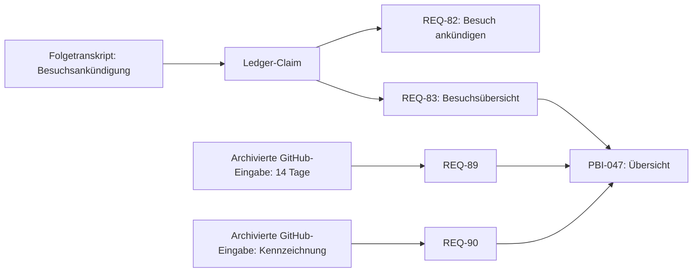

# Besuchsbeispiel: Quellen und spätere Ergänzungen

Stand 13.09.2026. Reale gespeicherte Fälle, keine hypothetische Ausführung. Darstellungsvorlage für den späteren Textnachzug; die Grafik ist eine Skizze und ändert keine bestehende Draw.io-Datei.

Die Pfeile zeigen hier die Leserichtung von Quelle zu Ergebnis. Im Core beschreibt `covers` die umgekehrte Prüfbewegung PBI → Anforderung. Alle drei bestehenden Kanten PBI-047 → REQ-83/89/90 werden ausgewertet. Die beiden späteren Anforderungen haben eigene Eingangsbelege; das ursprüngliche Transkript erklärt ihre Ergänzungen nicht allein.

## Konkrete Belegzugänge

### REQ-82

[Claim visit-planning-announcement](/Users/armino/devProjects/Agentic-SDLC/runs/fullworkflow/20260818_084712_765eea/01-ledger/consumable.json) (JSON-Pointer `/claims/7`).

Gebundenes Transkript: [meeting-4-ux-block-l.txt](/Users/armino/devProjects/Agentic-SDLC/input/transcripts/meeting-4-ux-block-l.txt). Zitatstatus und Unit-Zuordnung stehen separat im Audit; ein nur passender Zitatkörper wird nicht als vollständiges Sprecherzitat ausgegeben.

[Übernahmevorschlag](/Users/armino/devProjects/Agentic-SDLC/runs/fullworkflow/20260818_084712_765eea/07-ingest/plan.json) (JSON-Pointer `/operations/5`); [ausgeführte Zuordnung](/Users/armino/devProjects/Agentic-SDLC/runs/fullworkflow/20260818_084712_765eea/07-ingest/applied/delta.json) (JSON-Pointer `/applied/3`).

[Eingang REQ-04](/Users/armino/devProjects/Agentic-SDLC/runs/fullworkflow/20260818_084712_765eea/04-delta/project-state.json) (JSON-Pointer `/items/8`).

### REQ-83

[Claim visit-planning-announcement](/Users/armino/devProjects/Agentic-SDLC/runs/fullworkflow/20260818_084712_765eea/01-ledger/consumable.json) (JSON-Pointer `/claims/7`).

Gebundenes Transkript: [meeting-4-ux-block-l.txt](/Users/armino/devProjects/Agentic-SDLC/input/transcripts/meeting-4-ux-block-l.txt). Zitatstatus und Unit-Zuordnung stehen separat im Audit; ein nur passender Zitatkörper wird nicht als vollständiges Sprecherzitat ausgegeben.

[Übernahmevorschlag](/Users/armino/devProjects/Agentic-SDLC/runs/fullworkflow/20260818_084712_765eea/07-ingest/plan.json) (JSON-Pointer `/operations/6`); [ausgeführte Zuordnung](/Users/armino/devProjects/Agentic-SDLC/runs/fullworkflow/20260818_084712_765eea/07-ingest/applied/delta.json) (JSON-Pointer `/applied/4`).

[Eingang REQ-05](/Users/armino/devProjects/Agentic-SDLC/runs/fullworkflow/20260818_084712_765eea/04-delta/project-state.json) (JSON-Pointer `/items/9`).

### REQ-89

[Übernahmevorschlag](/Users/armino/devProjects/Agentic-SDLC/runs/fullworkflow/20260820_172043_802e63/07-ingest/plan.json) (JSON-Pointer `/operations/1`); [ausgeführte Zuordnung](/Users/armino/devProjects/Agentic-SDLC/runs/fullworkflow/20260820_172043_802e63/07-ingest/applied/delta.json) (JSON-Pointer `/applied/0`).

[Eingang GH-45](/Users/armino/devProjects/Agentic-SDLC/runs/fullworkflow/20260820_172043_802e63/00-github-inbound/inbound-delta.json) (JSON-Pointer `/items/1`).

[Eingang GH-45](/Users/armino/devProjects/Agentic-SDLC/runs/fullworkflow/20260820_172043_802e63/04-delta/project-state.json) (JSON-Pointer `/items/1`).

### REQ-90

[Übernahmevorschlag](/Users/armino/devProjects/Agentic-SDLC/runs/fullworkflow/20260820_173141_6e75fa/07-ingest/plan.json) (JSON-Pointer `/operations/0`); [ausgeführte Zuordnung](/Users/armino/devProjects/Agentic-SDLC/runs/fullworkflow/20260820_173141_6e75fa/07-ingest/applied/delta.json) (JSON-Pointer `/applied/0`).

[Eingang GH-45](/Users/armino/devProjects/Agentic-SDLC/runs/fullworkflow/20260820_173141_6e75fa/00-github-inbound/inbound-delta.json) (JSON-Pointer `/items/0`).

[Eingang GH-45](/Users/armino/devProjects/Agentic-SDLC/runs/fullworkflow/20260820_173141_6e75fa/04-delta/project-state.json) (JSON-Pointer `/items/0`).

### PBI-047: spätere Fortschreibung

[PBI-Übernahmebericht](/Users/armino/devProjects/Agentic-SDLC/runs/fullworkflow/20260820_173141_6e75fa/07-pbi-update/applied/pbi-update-apply-report.json) (JSON-Pointer `/updatedPbis/0`).

[Änderungsoperation bzw. Angleichung](/Users/armino/devProjects/Agentic-SDLC/runs/fullworkflow/20260820_173141_6e75fa/07-pbi-update/pbi-change-plan.json) (JSON-Pointer `/operations/0`).

[Änderungsoperation bzw. Angleichung](/Users/armino/devProjects/Agentic-SDLC/runs/fullworkflow/20260820_173141_6e75fa/07-pbi-update/pbi-change-plan.json) (JSON-Pointer `/alignments/0`).

## Was dieses Beispiel trägt

Die ursprüngliche fachliche Aussage und die späteren GitHub-Ergänzungen sind anhand verschiedener expliziter Belege zugänglich. Der jüngste PBI-Übergang ist mit Plan und Übernahmebericht verbunden. Das zeigt eine konkrete nachvollziehbare Fortschreibung. Es beweist keine fachliche Vollständigkeit aller Akzeptanzkriterien, keine allgemeine Zuverlässigkeit für beliebige Eingänge und keinen eigenständig gemessenen Vorteil menschlicher Prüfung. GitHub wurde für diese Nachauswertung nicht erneut online abgefragt.

REQ-42 bleibt ein separates Beispiel für Autor-Verfeinerung und wird nicht in diesen Besuchsfall hineingezogen.
